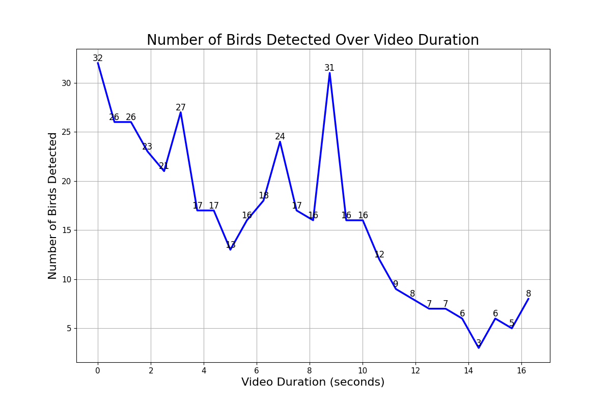

# Bird Detection from Video Files



This repository contains a Python application that performs bird detection from video files using the YOLOv5s model.

## How to Run

Install the necessary Python packages:

```bash
pip install -r requirements.txt
```

Run the main Python script:

```bash
python birds/main.py <path_to_video_file>
```

### Docker

The application can be run in a Docker container.

To build the Docker image:

```bash
docker build -t birds .
```

To run the Docker container:

```bash
docker run birds
```
