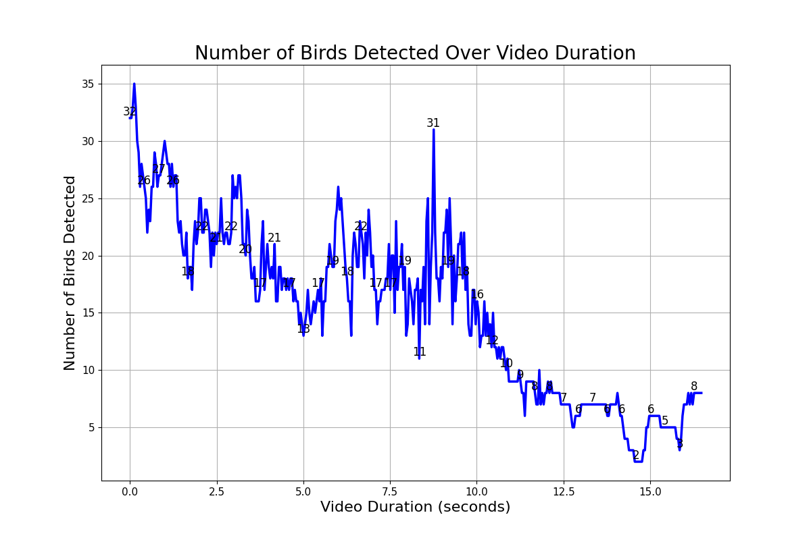

# Bird Detection from Video Files




This repository hosts a Python app for bird detection in video files using YOLOv5s model.

## How to Run

Install required Python packages:

```bash
pip install -r requirements.txt
```

Execute main script:

```bash
python birds/main.py <path_to_video_file>
```

### Docker

Run the app in a Docker container.

Build Docker image:

```bash
docker build -t birds .
```

Launch Docker container:

```bash
docker run birds
```

## Project analysis

### Method

Videos are processed to detect birds and data is record in a SQLite database via:

- Object Detection: Employing YOLOv5 object detection model on video frames.
- Data Storage: Storing detected object data (class, confidence score, bounding box coordinates, timestamp, frame number) in SQLite database.
- Data Visualization: Fetching bird detection data from database and plotting number of detected birds over video duration.

### Libraries

Used Python libraries include:

- cv2: For video processing and bounding box drawing.
- pandas: For data manipulation/analysis.
- sqlite3: For SQLite database interaction.
- YOLOv5: For object detection.
- matplotlib and seaborn: For data visualization.

### Design Decisions

Different Python modules are used for specific functionalities like file operations, database operations, video processing, and data visualization. Constants are used for file paths and frame intervals. SQLite enables lightweight, serverless data storage.

### Improvement Suggestions

- Enhance error handling.
- Include unit tests for code reliability and maintainability.
- Optimize performance via parallel processing of video frames.
- Preserve existing data and append new ones instead of deleting the entire database each run.
- More sophisticated visualizations like heatmaps for bird detection locations.
- Improve data insertion speed by employing bulk inserts in database operations.
- Consider a robust database system like Azure SQL for larger scale applications, offering benefits like automated backups, high availability, and greater data and user handling capabilities.
